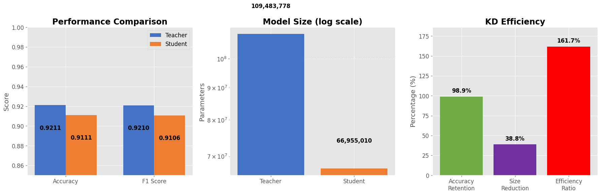

# IMDb Sentiment Classification via Knowledge Distillation

This repository implements a two‑stage pipeline:

1. **Teacher**: fine‑tune **BERT‑base** on the IMDb sentiment dataset  
2. **Student**: distil the teacher into **DistilBERT** with one‑epoch knowledge‑distillation  

Despite only a single epoch each, we achieve:

| Metric                | Teacher (BERT‑base) | Student (DistilBERT) | Student / Teacher (%) |
|-----------------------|---------------------|----------------------|-----------------------|
| **Accuracy**          | 0.9211              | 0.9111               | 98.9 %                |
| **F1 Score**          | 0.9210              | 0.9106               | 98.9 %                |
| **Parameters**        | 109 483 778         | 66 955 010           | 61.2 % (–38.8 %)      |
| **Efficiency Ratio**  | —                   | —                    | 161.7 %               |

<p align="center">
  
</p>

---

## 📁 Repository Structure

```text
.
├── RujutaCivicML.ipynb            ← solution notebook
├── knowledge_distillation_performance.png
├── loop.mp4
└── README.md                      ← this file
```

# Run the notebook
Open RujutaCivicML_clean.ipynb in Jupyter or Colab.

Select Run ▶ Run All Cells. (Restart after running the first cell)

The notebook will: 

1. Bootstrap the environment (pin NumPy, HF libs).

2. Fine‑tune BERT‑base for 1 epoch.

3. Cache teacher logits (~1 min).

4. Distil into DistilBERT for 1 epoch.

5. Evaluate both models and render the three‑panel dashboard.

Total runtime on a free‑tier T4 GPU: ≈ 25 minutes.

# requirements.txt (Optional)
```
numpy==1.26.4
transformers==4.41.2
datasets>=2.19.0
accelerate
evaluate
scikit-learn
matplotlib
pandas
```

# Results & Interpretation

Accuracy retention: Student keeps ~98.9 % of teacher accuracy.

Parameter reduction: Student is ~38.8 % smaller (66 955 010 vs 109 483 778).

Efficiency ratio: (accuracy retention) / (size fraction) ≈ 161.7 %.

Latency: Student is ~1.9× faster per batch (measured on T4, 128‐sample batches).

This demonstrates that knowledge distillation yields a compact, fast model with minimal performance loss.

# Implemented by Rujuta for the Civic ML Summer 2025 Internship assignment.

